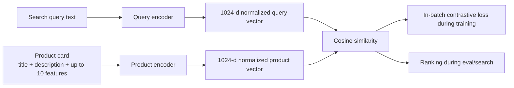
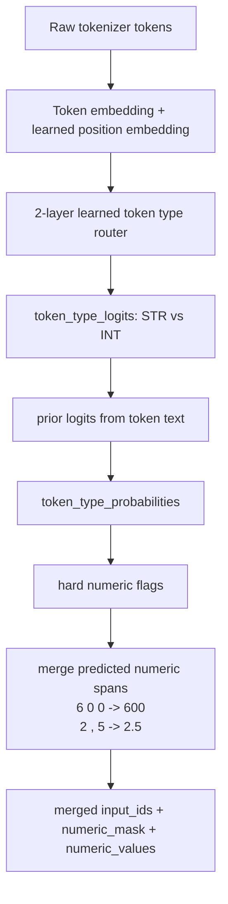
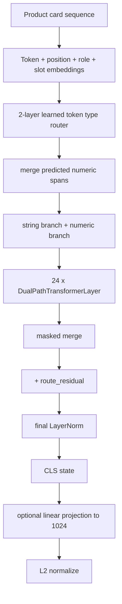
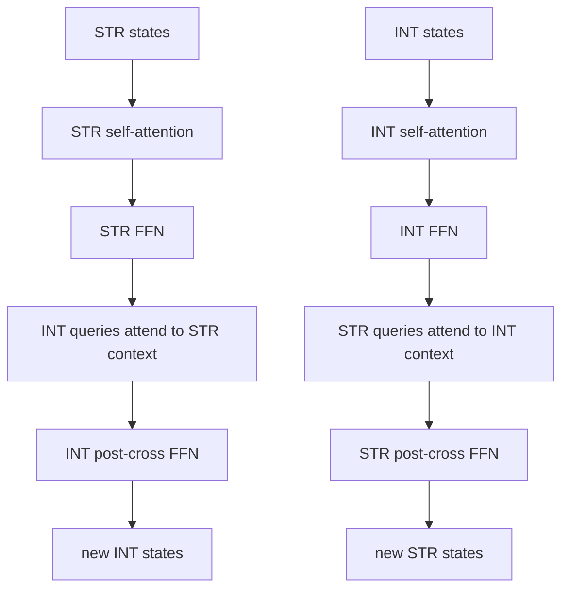

# Current Dual-Encoder Transformer Architecture

This document fixes the architecture that is currently implemented in:

- `hybrid_dual_path_model.py`
- `product_card_encoder.py`
- `dual_encoder_retrieval.py`
- `train_dual_encoder_on_parquet.py`

The model is not a single transformer. It is a dual encoder:

```text
query text -> QueryEncoder -> normalized query vector
product card -> ProductCardEncoder -> normalized product vector

score(query, product) = cosine(query_vector, product_vector)
```

## 1. Top Level



Current default builder values:

```text
embedding_dim = 1024
temperature = 0.05

query encoder:
  target_parameters = 3_000_000_000
  num_layers = 10
  num_heads = 16
  ff_multiplier = 4
  max_position_embeddings = 2048
  pooling = attention

product encoder:
  d_model = 1024
  num_layers = 24
  num_heads = 16
  ff_multiplier = 4
  max_position_embeddings = 8194
  max_features = 10
  pooling = CLS
```

On the previous Gemma tokenizer run the model printed:

```text
query_parameters   ~= 3.067B
product_parameters ~= 3.104B
total_parameters   ~= 6.171B
```

## 2. Query Encoder

Class: `HybridDualPathTransformer`.

Input:

```text
raw query text
  -> tokenizer
  -> raw input_ids + attention_mask + token_texts
```

Then the model itself does token type routing and numeric merge:



Important detail:

```text
The merge decision is hard/non-differentiable.
Gradient still reaches the token type router through route_residual,
merged_type_probabilities, and optional token_type_loss.
```

Embeddings after merge:

```text
base_states = token_embedding + learned_position_embedding + type_embedding

string_states  = string_input_mlp(base_states + string_route)
numeric_states = numeric_input_gate(
    NumericFeatureEncoder(numeric_values)
    + position_embedding
    + type_embedding
    + numeric_route
)
```

Query pooling:

```text
10 x DualPathTransformerLayer
  -> masked merge STR/INT states
  -> + route_residual
  -> + type_embedding
  -> final LayerNorm
  -> attention pooling
  -> optional linear projection to 1024
  -> L2 normalize
```

## 3. Product Card Encoder

Class: `BgeM3ProductCardEncoder`.

Input product layout:

```text
ProductCard:
  title: str
  description: str
  features[0..9]:
    name: str
    value: str | int | float | None
```

Sequence construction:

```text
<cls>
title tokens
<sep>
description tokens
<sep>
feature_1 name tokens
<sep>
feature_1 value tokens
<sep>
...
feature_10 name tokens
<sep>
feature_10 value tokens
<sep>
```

Extra embeddings on product side:

```text
token_embedding
+ learned_position_embedding
+ type_embedding       # STR / INT after routing and merge
+ role_embedding       # CLS / title / description / feature_name / feature_value / separator
+ slot_embedding       # 0 for title/description, 1..10 for features
```

Product encoder flow:



Product pooling is currently CLS-only:

```text
cls_state = mixed_states[:, 0, :]
```

## 4. Learned Token Type Router

Class: `LearnedTokenTypeRouter`.

Used in both query and product encoders.

Architecture:

```text
2 x TokenTypeTransformerLayer
  each layer:
    MaskedAttentionBlock
    MaskedFeedForwardBlock(ff_multiplier=2)

output_norm
type_head: Linear(d_model, 2)
route_ffn:
  LayerNorm
  Linear(d_model, d_model)
  GELU
  Dropout
  Linear(d_model, d_model)
```

Output:

```text
logits[..., 0] = STR
logits[..., 1] = INT
probabilities = softmax(logits + text_prior_logits)
route_residual = route_ffn(hidden_states)
```

The model can also compute auxiliary token type loss:

```text
token_type_loss_weight = 0.1 by default in training
```

## 5. Numeric Encoder

Class: `NumericFeatureEncoder`.

For each numeric token value `x`:

```text
signed_log = sign(x) * log1p(abs(x))
magnitude  = log1p(abs(x))
sign       = sign(x)
is_zero    = x == 0
sin/cos multi-frequency features with frequencies 2^k, k=0..15
learnable RBF features, 16 bins
```

Feature vector:

```text
4 scalar features + 32 sin/cos features + 16 RBF features = 52 features
```

Projection:

```text
LayerNorm(52)
Linear(52, 2*d_model)
MaskedSequenceBatchNorm1d
GELU
Dropout
Linear(2*d_model, d_model)
LayerNorm(d_model)
```

## 6. One DualPathTransformerLayer

Class: `DualPathTransformerLayer`.

One layer contains two separate streams and two cross-attentions:



Each attention block:

```text
LayerNorm(query)
LayerNorm(context)
MultiheadAttention(batch_first=True)
MaskedSequenceBatchNorm1d
residual + Dropout
LayerNorm
mask output
```

Each FFN block:

```text
LayerNorm
FeedForward
MaskedSequenceBatchNorm1d
residual + Dropout
LayerNorm
mask output
```

FeedForward is:

```text
Linear(d_model, d_model * ff_multiplier)
GELU
Dropout
Linear(d_model * ff_multiplier, d_model * ff_multiplier)
GELU
Dropout
Linear(d_model * ff_multiplier, d_model)
```

## 7. Positional Encoding

Both encoders use learned absolute positional embeddings:

```text
nn.Embedding(max_position_embeddings, d_model)
```

There is no RoPE/ALiBi/sinusoidal positional encoding in the current implementation.

## 8. Attention Masking

Query encoder:

```text
causal = False by default
attention is bidirectional encoder attention
```

Product encoder:

```text
attention is bidirectional
attn_mask = None
```

Both branches still use masks:

```text
string_mask  = merged_attention_mask & ~numeric_mask
numeric_mask = merged_attention_mask & numeric_mask
```

## 9. Training Objective

Training wrapper: `ProductQueryDualEncoder`.

For a batch:

```text
query_embeddings   = query_encoder(queries).normalized_embedding
product_embeddings = product_encoder(products).normalized_embedding
similarity = query_embeddings @ product_embeddings.T
loss = contrastive_retrieval_loss(similarity / temperature)
```

Default:

```text
symmetric_loss = True
```

So the objective trains both directions:

```text
query -> product
product -> query
```

The training script also supports auxiliary token type loss from both encoders.

## 10. Current High-Level Shape

```text
DualEncoder
  QueryEncoder: HybridDualPathTransformer
    embeddings: token + learned position + type
    token type router: 2 transformer layers
    numeric merge: learned STR/INT probabilities + text priors
    numeric encoding: log/RBF/sin-cos MLP
    backbone: 10 dual-path transformer layers
    pooling: attention pooling
    output: 1024-d L2-normalized vector

  ProductEncoder: BgeM3ProductCardEncoder
    input: title + description + up to 10 feature(name, value)
    embeddings: token + learned position + type + role + slot
    token type router: 2 transformer layers
    numeric merge: learned STR/INT probabilities + text priors
    numeric encoding: log/RBF/sin-cos MLP
    backbone: 24 dual-path transformer layers
    pooling: CLS state
    output: 1024-d L2-normalized vector

  Similarity:
    cosine similarity through dot product of normalized vectors
```

## 11. Main Gaps To Revisit Next

These are not necessarily bugs, but they are the most important architectural choices to review before improving the model:

- The product encoder has 24 layers while the query encoder has 10 layers; this conflicts with the earlier "10 transformer layers total/per encoder" target if that target is still active.
- The full default dual encoder is about 6.17B parameters with the Gemma tokenizer, not 3B total.
- Numeric span merge is hard and CPU/list based, so routing gradients do not flow through the discrete merge decision itself.
- Product pooling is CLS-only, while query pooling is attention pooling.
- Both encoders use learned absolute position embeddings, so extrapolation beyond trained sequence lengths is weak.
- The token type router still uses text-prior logits; it is learned, but not purely learned.
