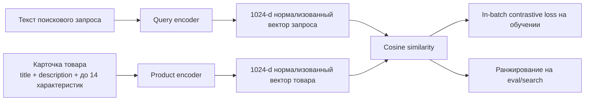
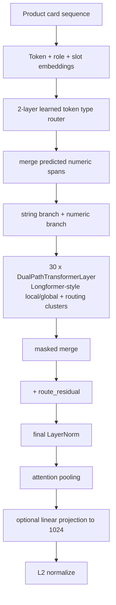
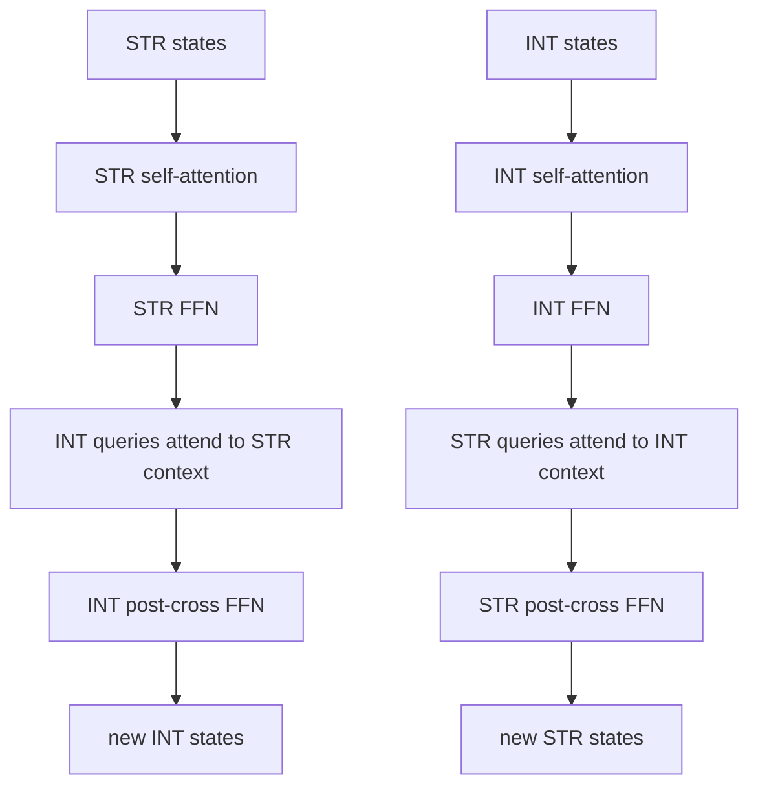

# Текущая архитектура dual-encoder трансформера

Этот документ фиксирует архитектуру, которая сейчас реально реализована в коде:

- `hybrid_dual_path_model.py`
- `product_card_encoder.py`
- `dual_encoder_retrieval.py`
- `train_dual_encoder_on_parquet.py`

Модель сейчас не является одним трансформером. Это dual encoder:

```text
текстовый запрос -> QueryEncoder -> нормализованный вектор запроса
карточка товара  -> ProductEncoder -> нормализованный вектор товара

score(query, product) = cosine(query_vector, product_vector)
```

## 1. Верхний уровень



Текущие дефолты builder-а:

```text
embedding_dim = 1024
temperature = 0.05

query encoder:
  target_parameters = 3_000_000_000
  num_layers = 30
  token_type_router_layers = 4
  num_heads = 16
  ff_multiplier = 4
  max_position_embeddings = 2048
  pooling = attention

product encoder:
  d_model = 1024
  num_layers = 30
  token_type_router_layers = 4
  num_heads = 16
  ff_multiplier = 4
  max_position_embeddings = 8194
  max_features = 14
  pooling = attention
  local_attention_window = 128
  max_routing_clusters = 128
```

На прошлом запуске с Gemma tokenizer модель печатала:

```text
query_parameters   ~= 3.067B
product_parameters ~= 3.104B
total_parameters   ~= 6.171B
```

## 2. Query encoder

Класс: `HybridDualPathTransformer`.

Вход:

```text
сырой текст запроса
  -> tokenizer
  -> raw input_ids + attention_mask + token_texts
```

Дальше модель сама делает определение типа токена и склейку чисел:

```mermaid
flowchart TD
    A[Сырые tokenizer tokens] --> B[Token embedding]
    B --> C[2-layer learned token type router]
    C --> D[token_type_logits: STR vs INT]
    C --> E[join logits для соседних токенов]
    D --> F[token_type_probabilities]
    E --> G[join probabilities]
    F --> H[soft numeric mass]
    G --> H
    H --> I[semi-Markov numeric span lattice<br/>6 0 0 -> NumericEncoder(600)<br/>2 , 5 -> NumericEncoder(2.5)]
    I --> J[raw-length soft numeric embeddings]
```

Важная деталь:

```text
Sequence length больше не меняется в forward.
Numeric branch получает weighted NumericEncoder(value(span)), а не hard-склейку Python list.
Join-head обучается через BCE + semi-Markov CRF NLL + bad-span suppression.
Retrieval loss тоже дифференцируется в join-head через posterior weights.
`merged_token_texts` теперь диагностический Viterbi-вывод, а не фактическая длина hidden states.
```

После differentiable span lattice:

```text
string_base = token_embedding + STR type_embedding

string_states  = string_input_mlp(string_base + string_route) * p_str
numeric_states = numeric_input_gate(
    expected_span_embedding
    + INT type_embedding
    + numeric_route
) * numeric_mass
```

Выход query encoder:

```text
30 x DualPathTransformerLayer
  -> soft sum STR/INT states
  -> + route_residual
  -> + soft type embedding
  -> final LayerNorm
  -> attention pooling
  -> optional linear projection to 1024
  -> L2 normalize
```

## 3. Product card encoder

Класс: `BgeM3ProductCardEncoder`.

Формат карточки:

```text
ProductCard:
  title: str
  description: str
  features[0..9]:
    name: str
    value: str | int | float | None
```

Последовательность строится так:

```text
<cls>
title tokens
<sep>
description tokens
<sep>
feature_1 name tokens
<sep>
feature_1 value tokens
<sep>
...
feature_14 name tokens
<sep>
feature_14 value tokens
<sep>
```

Дополнительные embeddings у product encoder:

```text
token_embedding
+ type_embedding       # STR / INT после router и merge
+ role_embedding       # CLS / title / description / feature_name / feature_value / separator
+ slot_embedding       # 0 для title/description, 1..14 для характеристик
```

Общий flow product encoder:



Product pooling сейчас attention-based:

```text
AttentionPooling(mixed_states, merged_attention_mask)
optional Linear(d_model, 1024)
L2 normalize
```

## 4. Learned token type router

Класс: `LearnedTokenTypeRouter`.

Используется и в query encoder, и в product encoder.

Архитектура:

```text
4 x TokenTypeTransformerLayer
  каждый слой:
    MaskedAttentionBlock
    MaskedFeedForwardBlock(ff_multiplier=2)

output_norm
type_head: Linear(d_model, 2)
route_ffn:
  LayerNorm
  Linear(d_model, d_model)
  GELU
  Dropout
  Linear(d_model, d_model)
```

Выход:

```text
logits[..., 0] = STR
logits[..., 1] = INT
probabilities = softmax(logits + text_prior_logits)
route_residual = route_ffn(hidden_states)
```

Также на обучении может считаться вспомогательный loss:

```text
token_type_loss_weight = 0.1 по умолчанию
```

## 5. Numeric encoder

Класс: `NumericFeatureEncoder`.

Для каждого числового токена `x`:

```text
signed_log = sign(x) * log1p(abs(x))
magnitude  = log1p(abs(x))
sign       = sign(x)
is_zero    = x == 0
sin/cos multi-frequency features, frequencies = 2^k, k=0..15
learnable RBF features, 16 bins
```

Размер сырого numeric feature vector:

```text
4 scalar features + 32 sin/cos features + 16 RBF features = 52 features
```

Projection:

```text
LayerNorm(52)
Linear(52, 2*d_model)
MaskedSequenceBatchNorm1d
GELU
Dropout
Linear(2*d_model, d_model)
LayerNorm(d_model)
```

## 6. Один DualPathTransformerLayer

Класс: `DualPathTransformerLayer`.

В одном слое есть две отдельные ветки и два cross-attention:



Каждый attention block:

```text
LayerNorm(query)
LayerNorm(context)
RotaryMultiheadAttention
Dropout
```

Каждый FFN block:

```text
LayerNorm
FeedForward
Dropout
```

FeedForward сейчас такой:

```text
Linear(d_model, d_model * ff_multiplier)
GELU
Dropout
Linear(d_model * ff_multiplier, d_model * ff_multiplier)
GELU
Dropout
Linear(d_model * ff_multiplier, d_model)
```

## 7. Позиционное кодирование

Learned absolute position embedding убран из обоих encoder-ов.
Позиция теперь задается через RoPE внутри attention:

```text
RoPE(q), RoPE(k)
```

Для product encoder дополнительно остаются learned role/slot embeddings.
`max_position_embeddings` используется как лимит длины, а не как таблица параметров.

## 8. Attention masking

Query encoder:

```text
causal = False по умолчанию
attention bidirectional, encoder-style
```

Product encoder:

```text
Longformer-style sparse attention:
- local window по позициям
- global tokens: CLS, title, description, feature_name
- separator не global
- routing clusters в каждом слое, cluster_count = ceil(sqrt(active_tokens))
```

Внутри обеих веток используются маски:

```text
string_mask  = merged_attention_mask & ~numeric_mask
numeric_mask = merged_attention_mask & numeric_mask
```

## 9. Training objective

Wrapper: `ProductQueryDualEncoder`.

На батче:

```text
query_embeddings   = query_encoder(queries).normalized_embedding
product_embeddings = product_encoder(products).normalized_embedding
similarity = query_embeddings @ product_embeddings.T
loss = contrastive_retrieval_loss(similarity / temperature)
```

По умолчанию:

```text
symmetric_loss = True
```

То есть модель обучается в обе стороны:

```text
query -> product
product -> query
```

Плюс training script поддерживает вспомогательный `token_type_loss` для обоих encoder-ов.

## 10. Текущая форма модели в одну схему

```text
DualEncoder
  QueryEncoder: HybridDualPathTransformer
    embeddings: token + type
    token type router: 2 transformer layers
    numeric merge: semi-Markov CRF span lattice + learned join probabilities
    numeric encoding: log/RBF/sin-cos MLP
    position: RoPE inside attention
    backbone: 10 dual-path transformer layers
    pooling: attention pooling
    output: 1024-d L2-normalized vector

  ProductEncoder: BgeM3ProductCardEncoder
    input: title + description + up to 14 feature(name, value)
    embeddings: token + type + role + slot
    token type router: 2 transformer layers
    numeric merge: semi-Markov CRF span lattice + learned join probabilities
    numeric encoding: log/RBF/sin-cos MLP
    position: RoPE inside attention
    backbone: 30 dual-path transformer layers with local/global+routing sparse self-attention
    pooling: attention pooling
    output: 1024-d L2-normalized vector

  Similarity:
    cosine similarity через dot product нормализованных векторов
```

## 11. Главные места для улучшения

Оставшиеся ограничения:

- Numeric merge теперь дифференцируемый, но sequence length остается raw-token length; фактическое сжатие в один physical token не делается, чтобы не рвать граф.
- Product encoder теперь использует sparse attention, поэтому качество зависит от выбора `local_attention_window` и routing clusters.
- Старые checkpoint-ы с learned absolute position/MultiheadAttention структурой архитектурно несовместимы с новой моделью без отдельной миграции весов.
