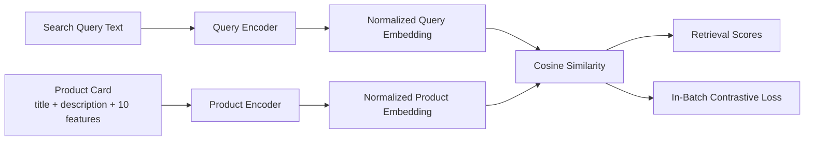

# Dual Encoder Retrieval Diagram

Текущая реализация находится в `dual_encoder_retrieval.py`.

## 1. High-Level Flow



## 2. Query Side

```text
raw query text
  -> tokenizer
  -> numeric span merge
  -> STR / INT split
  -> 10-layer dual-path query encoder
  -> attention pooling
  -> dense projection
  -> L2 normalization
```

## 3. Product Side

```text
product title + description + up to 10 feature(name, value) pairs
  -> tokenizer per segment
  -> numeric span merge
  -> role embeddings + slot embeddings
  -> STR / INT split for feature values and text
  -> BGE-M3-style product encoder backbone
  -> CLS dense projection
  -> L2 normalization
```

## 4. Training

```text
query_embedding[i] should be close to product_embedding[i]
query_embedding[i] should be far from product_embedding[j], j != i

loss = in-batch contrastive retrieval loss
```

## 5. Code Map

- `ProductQueryDualEncoder`: общий wrapper
- `score_pairs(...)`: полный путь query + product -> similarity + loss
- `build_product_query_dual_encoder_from_tokenizer_json(...)`: production-like builder
- `build_small_dual_encoder_from_tokenizer_json(...)`: smoke-test / dev builder
