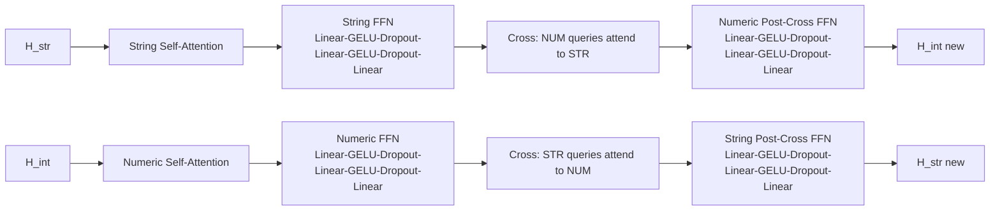

# Hybrid Dual-Path Model Diagram

Текущая схема соответствует реализации в `hybrid_dual_path_model.py`.

Ключевая идея:
- `STR` токены идут в левую ветку.
- `INT` токены идут в правую ветку.
- Если tokenizer разбил число на куски, на этапе post-processing они склеиваются в один numeric token.
- Дальше обе ветки проходят через 5 dual-path transformer layers и собираются обратно по маске.

## 0. Current Status

Что уже реализовано:
- отдельный модуль модели `hybrid_dual_path_model.py`
- ветвление `STR` / `INT`
- числовой энкодер `log1p + multi-frequency + RBF + linear`
- 10 dual-path transformer layers по умолчанию
- FFN внутри transformer layer: `Linear -> GELU -> Dropout -> Linear -> GELU -> Dropout -> Linear`
- двусторонний cross-attention между `STR` и `INT`
- masked merge обратно в общую последовательность
- attention pooling / mean / cls pooling
- retrieval vector + `L2` normalization для cosine similarity
- contrastive retrieval loss для обучения query/item пар
- raw text preprocessing: merge `6 | 0 | 0 -> 600` встроен в общий encoder pipeline
- отдельный скрипт `tokenize_sku_queries.py`, который использует тот же merge logic для анализа запросов

Что важно понимать про текущее состояние:
- learned positional embeddings уже есть внутри модели
- attention у энкодера некаузальная, то есть каждый токен видит всю последовательность
- модель теперь умеет идти от raw texts до normalized embeddings через helper pipeline
- для production еще останется только training loop / dataset / ANN index

Упрощенно:
- сейчас модель умеет работать с `numeric_mask` и `numeric_values`
- сейчас модель на выходе дает один embedding-вектор запроса
- этап "из сырых tokenizer pieces собрать один numeric token span" теперь есть в общем preprocessing API

## 1. End-to-End Diagram

```mermaid
flowchart TD
    A[Raw Query Text] --> B[Tokenizer]
    B --> C[Numeric Span Merge<br/>6 | 0 | 0 -> 600]
    C --> D[input_ids]
    C --> E[numeric_mask<br/>1 = INT, 0 = STR]
    C --> F[numeric_values<br/>600, 605, 900, ...]

    D --> G[Token Embedding]
    G --> H[Base Token States]
    E --> I[Type Embedding<br/>STR=0, INT=1]
    I --> H
    J[Position Embedding] --> H

    H --> K[String Input MLP]
    H --> L[Numeric Input Gate]
    F --> M[Numeric Feature Encoder<br/>sign(x)*log1p(|x|)<br/>sin/cos multi-frequency<br/>RBF features<br/>linear projection]
    J --> L
    I --> L
    M --> L

    K --> N
    L --> N

    subgraph N[10 x DualPathTransformerLayer]
        N1[String Self-Attention]
        N2[String FFN<br/>3-layer GELU MLP]
        N3[Numeric Self-Attention]
        N4[Numeric FFN<br/>3-layer GELU MLP]
        N5[Cross Attention<br/>NUM queries <- STR context]
        N6[Cross Attention<br/>STR queries <- NUM context]
        N7[Numeric Post-Cross FFN<br/>3-layer GELU MLP]
        N8[String Post-Cross FFN<br/>3-layer GELU MLP]

        N1 --> N2
        N3 --> N4
        N2 --> N5
        N4 --> N6
        N5 --> N7
        N6 --> N8
    end

    N --> O[String Hidden States]
    N --> P[Numeric Hidden States]

    O --> Q[Masked Merge<br/>H = H_str * mask_str + H_int * mask_int]
    P --> Q
    E --> R[Type Embedding Add]
    Q --> R
    R --> S[Final LayerNorm]
    S --> T[Pooling<br/>attention or mean or CLS]
    T --> U[Retrieval Embedding]
    U --> V[L2 Normalize]
    V --> W[Cosine Similarity Search]
    V --> X[Contrastive Training Loss]
```

## 2. One Transformer Layer



## 3. Mapping to Code

- `TokenTypeMaskBuilder`: строит `numeric_mask` и `numeric_values`.
- `prepare_hybrid_batch_from_tokenizer*`: готовит encoder batch из raw text и склеивает numeric spans.
- `NumericFeatureEncoder`: кодирует numeric tokens в dense vectors.
- `DualPathTransformerLayer`: один слой с self-attention, cross-attention и FFN.
- `HybridDualPathTransformer`: собирает embeddings, 10 слоев, merge, pooling и retrieval embedding.
- `cosine_similarity_matrix`: считает попарное cosine similarity между embedding-векторами.
- `contrastive_retrieval_loss`: обучает query/item embeddings под retrieval.
- `suggest_hybrid_retrieval_config*`: подбирает конфиг под целевой бюджет параметров, например около `2B`.
- `build_target_size_retrieval_model_from_tokenizer_json(...)`: собирает retrieval-модель под целевой размер.

## 4. Real State in One Line

```text
RAW TEXT
  -> tokenizer
  -> numeric span merge
  -> input_ids + numeric_mask + numeric_values
  -> string branch + numeric branch
  -> 10 x dual-path transformer
  -> merge by mask
  -> pooled embedding
  -> L2 normalization
  -> cosine similarity retrieval
```

## 5. Target Size

Целевой production-вариант для retrieval:
- `10` transformer layers
- финальный `normalized_embedding`
- поиск пары через cosine similarity
- целевой размер модели около `2B` параметров

Практически это означает:
- retrieval-режим без `LM head`
- подбор `d_model` под размер словаря
- для текущего tokenizer конфиг можно оценить через `suggest_hybrid_retrieval_config_from_tokenizer_json(...)`
