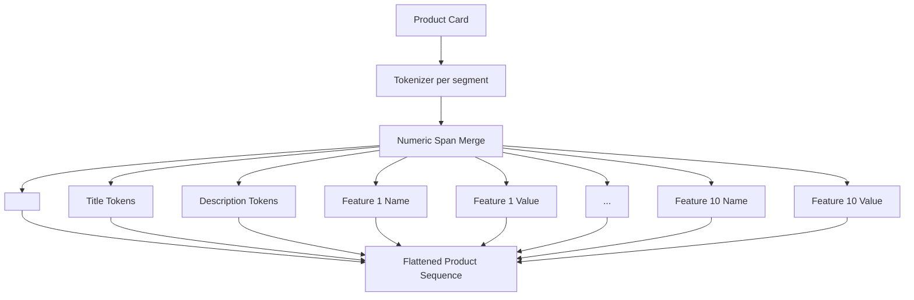
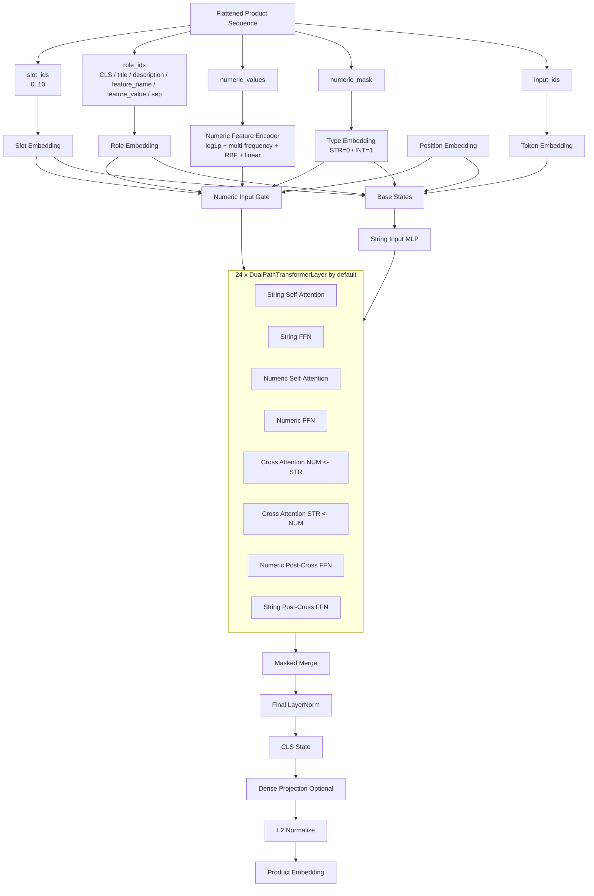

# Product Card Encoder Diagram

Текущая реализация находится в `product_card_encoder.py`.

Идея:
- backbone взят в стиле `BGE-M3`: encoder-only, bidirectional attention, `CLS`-style dense embedding
- структура карточки товара добавлена сверху:
  - `title`
  - `description`
  - до `10` характеристик
  - у каждой характеристики есть `name` и `value`
- numeric spans внутри текста и значений склеиваются:
  - `6 | 0 | 0 -> 600`
  - `2 | . | 5 -> 2.5`
- numeric tokens идут в `INT` branch, остальные в `STR` branch

## 1. Card Layout

```text
ProductCard
  title: str
  description: str
  features[0..9]:
    - name: str
    - value: str | int | float
```

## 2. Sequence Construction



## 3. Encoder Architecture



## 4. Output

```text
Product Card
  -> normalized_embedding
  -> cosine similarity with query embedding
```

## 5. Code Map

- `ProductCard`, `ProductFeature`: структура входной карточки
- `prepare_product_card_batch_from_tokenizer*`: готовит batch из карточек
- `BgeM3ProductCardEncoder`: сам encoder
- `encode_cards*`: путь от карточек до embedding-векторов
